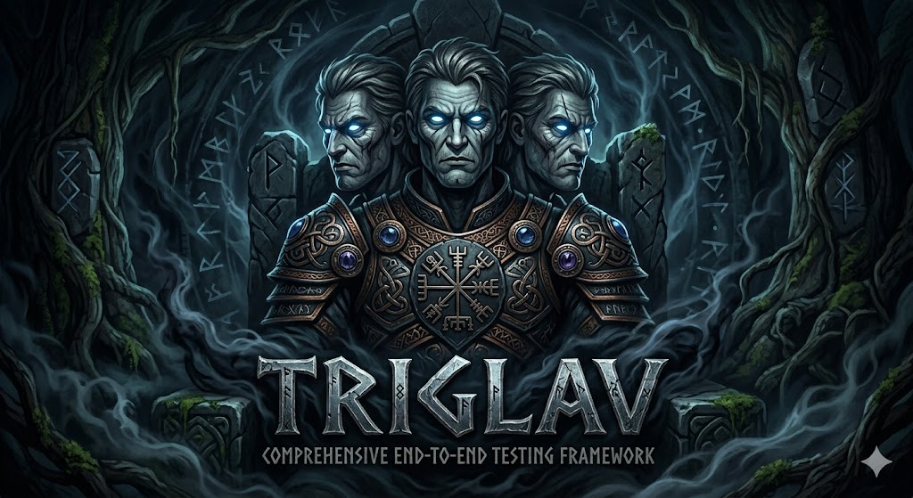

# Triglav

## End-to-End Tests Framework

Repository-level framework used to validate `devops-infra` automation end-to-end, with a focus on GitHub Actions behavior in real workflow runs.



## Why Triglav

In Slavic mythology, Triglav represents three realms. That maps well to this framework's validation layers:

- pull request lifecycle and branch management behavior
- integration tests against live GitHub runtime
- periodic regression testing to catch unexpected changes

## Scope

- Executes reusable and action-specific E2E workflows in this repository.
- Verifies outputs, expected failures, and integration behavior against live GitHub runtime.
- Provides a stable place to add regression tests before rolling changes organization-wide.

## Covered Actions and Test Types

| Action                                         | Workflow                                                    | Test Coverage                                                                                                                   |
|------------------------------------------------|-------------------------------------------------------------|---------------------------------------------------------------------------------------------------------------------------------|
| `devops-infra/action-commit-push`              | `.github/workflows/e2e-action-commit-push.yml`              | branch creation/push, custom message/prefix, empty commit mode, amend with force-with-lease, output verification, cleanup       |
| `devops-infra/action-pull-request`             | `.github/workflows/e2e-action-pull-request.yml`             | PR creation/update paths, custom title/body, draft + `get_diff`, `repository` + `repository_path`, output verification, cleanup |
| `devops-infra/action-format-hcl`               | `.github/workflows/e2e-action-format-hcl.yml`               | check mode pass/fail, write mode, list/diff mode, malformed input detection                                                     |
| `devops-infra/action-container-structure-test` | `.github/workflows/e2e-action-container-structure-test.yml` | text/json/junit output modes, report file creation, multi-config execution, output counters                                     |
| `devops-infra/action-terraform-copy-vars`      | `.github/workflows/e2e-action-terraform-copy-vars.yml`      | variable propagation across modules, custom path inputs, strict missing-variable failure mode                                   |
| `devops-infra/action-terraform-validate`       | `.github/workflows/e2e-action-terraform-validate.yml`       | valid module validation, scoped validation via `dir_filter`                                                                     |
| `devops-infra/action-tflint`                   | `.github/workflows/e2e-action-tflint.yml`                   | lint execution across modules, scoped lint via `dir_filter`, non-blocking findings mode                                         |
| `devops-infra/template-action`                 | `.github/workflows/e2e-action-template-action.yml`          | baseline template behavior validation, output contract checks, debug-mode execution                                             |

## Workflow Orchestration

- Main orchestrator: `.github/workflows/cron-e2e-tests.yml`
- Triggers:
  - weekly cron schedule
  - manual dispatch (`workflow_dispatch`)
- Executes all action-focused E2E workflows via reusable `workflow_call` jobs.

## Local Development

Prerequisites:

- `task`
- `docker`
- `gh` (authenticated)

Common commands:

```bash
task lint
task pre-commit
task e2e:list-workflows
task e2e:run WORKFLOW=e2e-action-pull-request.yml
task e2e:run:all
task test:coverage:report
task test:coverage:gate
```

Useful follow-up commands:

```bash
task e2e:view-latest WORKFLOW=e2e-action-pull-request.yml
task e2e:watch RUN_ID=<run-id>
```

## Manual Workflow Runs: Permissions and Secrets

When triggering workflows manually with `gh workflow run`, ensure:

- Your local GitHub CLI token has `repo` and `workflow` scopes.
- `gh auth status` is healthy for the same GitHub account that can run workflows in this repository.
- Workflow job permissions remain enabled for tested actions:
  - `contents: write` for branch/commit operations (`action-commit-push`, `action-pull-request` tests)
  - `pull-requests: write` and `issues: write` for PR lifecycle operations (`action-pull-request` tests)
  - `contents: read` for read-only action workflows (`action-format-hcl`, `action-tflint`, `action-terraform-*`, `action-container-structure-test`)

Manual dispatch examples:

```bash
task e2e:run WORKFLOW=e2e-action-commit-push.yml
task e2e:run:all
```

This repository primarily relies on the built-in `${{ secrets.GITHUB_TOKEN }}` in workflow runs.
If future scenarios require elevated credentials, define additional secrets in repository settings and document them in the specific workflow file.

## Input Coverage Gate

- Coverage report: `task test:coverage:report`
- Strict gate: `task test:coverage:gate`
- Baseline file for currently accepted uncovered inputs: `tests/coverage-baseline.json`

The strict gate fails only when newly uncovered inputs appear outside the baseline.

## Reusable Workflow Usage in Action Repositories

Each `e2e-action-*.yml` workflow supports `workflow_call`, so action repositories can reuse this framework for pre-merge checks.

Current org-wide automation wiring:

- Pull request flow (`reusable-auto-pull-request-create.yml`) calls action-specific E2E workflows for `action-*` repositories.
- Release branch prepare flow (`reusable-manual-release-branch-prepare.yml`) calls action-specific E2E workflows against `release/*` refs and `-rc` tags.
- Release create flow (`reusable-auto-release-create.yml`) calls action-specific E2E workflows against production release tags/images.

Recommended pre-merge strategy:

- Run E2E with action refs that point to the PR under test (branch or SHA).
- Run image-tag verification stages for `-test` and `-rc` tags after image publication in release pipelines.

Current image-mode implementation:

- `e2e-action-format-hcl.yml` supports executable `mode: image` using `image_tag`.
- `e2e-action-tflint.yml` supports executable `mode: image` using `image_tag`.
- `e2e-action-terraform-validate.yml` supports executable `mode: image` using `image_tag`.
- `e2e-action-terraform-copy-vars.yml` supports executable `mode: image` using `image_tag`.
- `e2e-action-container-structure-test.yml` currently uses `mode: ref` as authoritative path in reusable CI flows.
- `e2e-action-commit-push.yml` and `e2e-action-pull-request.yml` use `mode: ref` as authoritative path in reusable CI flows.

Example caller from another action repository:

```yaml
jobs:
  e2e-pr-validation:
    uses: devops-infra/triglav/.github/workflows/e2e-action-pull-request.yml@master
    with:
      mode: image
      image_tag: v1.2.3-test
```

## Notes

- E2E workflows intentionally create temporary test branches and pull requests and then clean them up.
- Use this repository to validate behavior before promoting changes in action repositories or reusable org workflows.
